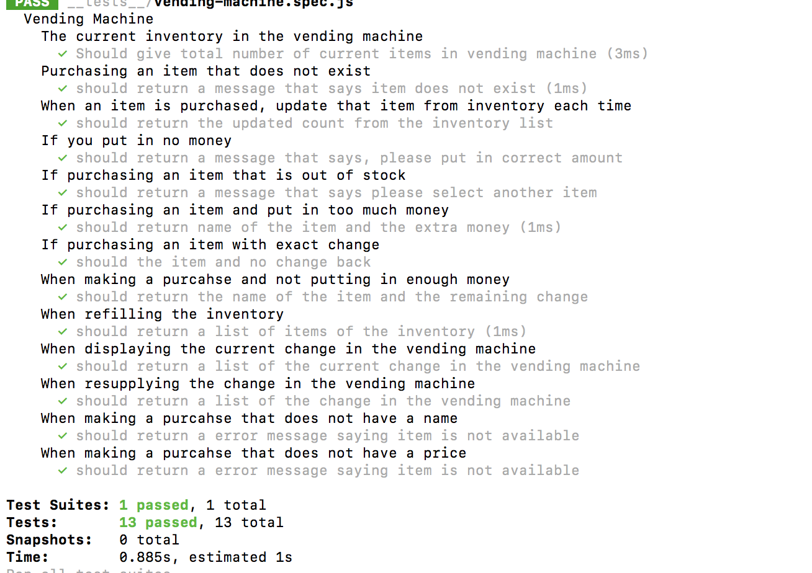

#Description

The required scope was to implement a vending machine in JavaScript by using Test Driven Development. It dispenses, prints and restocks the vending machine inventory. In addition, it refills and returns coins.

#Getting Started

Clone this project.
git clone < project directory .git >

#Setup
npm install

#Test
npm test

#Technolgies
JavaScript
Node
Jest

#Personal learning:

1. Intro to Test Driven Development(TDD)
2. More on TDD
3. Behaviour Driven Development
4. The Coding Interview
5. By using objects instead of arrays inside class decleration, it reduces the complexity of methods inside (performance FTW!)

#Author
Saveen Toor, Full-Stack Developer student at Red Academy.

